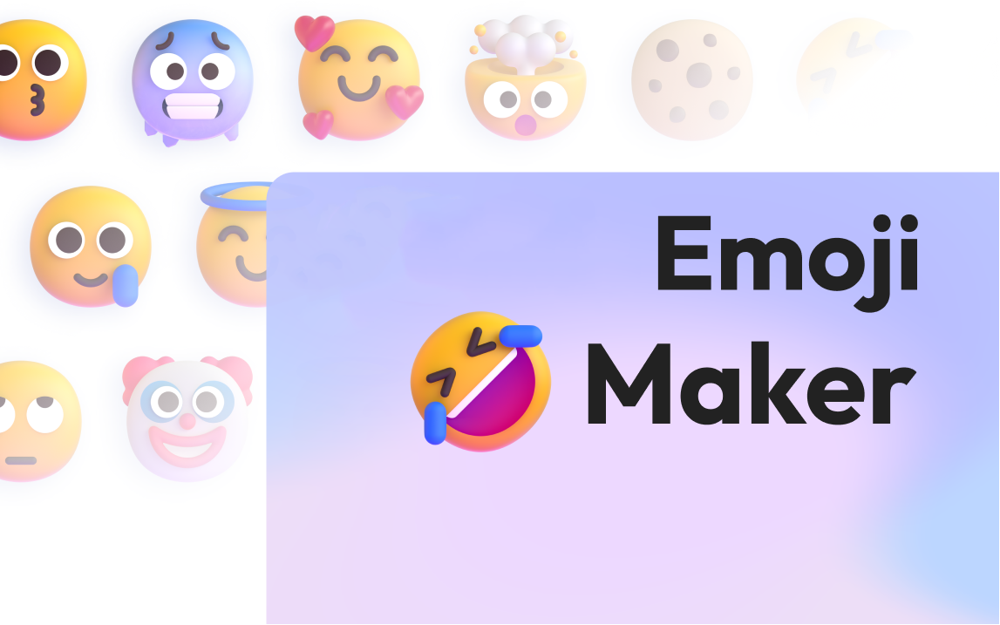

  

###

<h3 align="left">Connect with me:</h3>

###

<h1 align="center">hey there 👋</h1>

###

  

###

 <h4 align="left">💔 love has a cost, and both of us lost
</h4>

###

<h3 align="left"> What i'am listening to </h3>

###

Support me

- 👉 🇮🇩 [Trakteer](https://trakteer.id/lrmn)
- 👉 🌍 [BuyMeACoffe](https://www.buymeacoffee.com/lrmn)

# Emoji Maker

  

Generate your own Fluent Emojis!

[Emoji Maker](https://emoji-maker.is-a.fun/)

## Credits

Assets are from [Fluent Emoji](https://github.com/microsoft/fluentui-emoji) by Microsoft. Remixed and partially modified.

